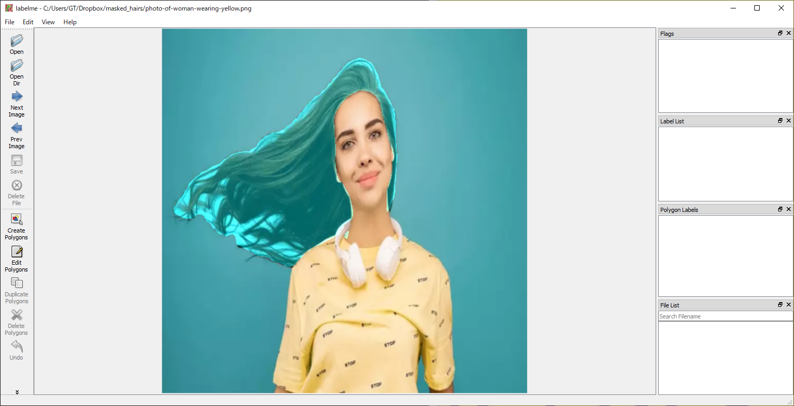
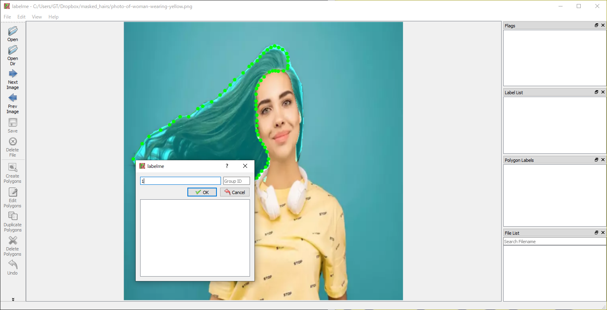
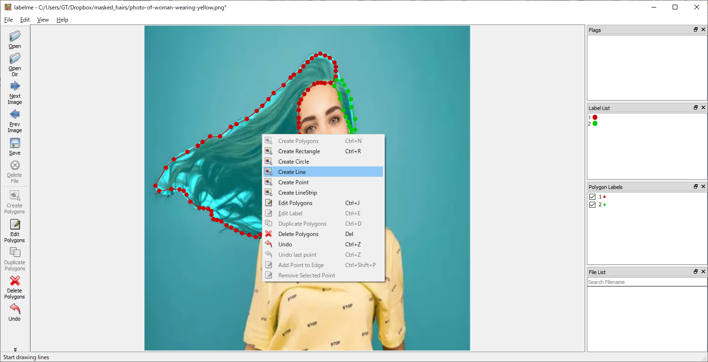
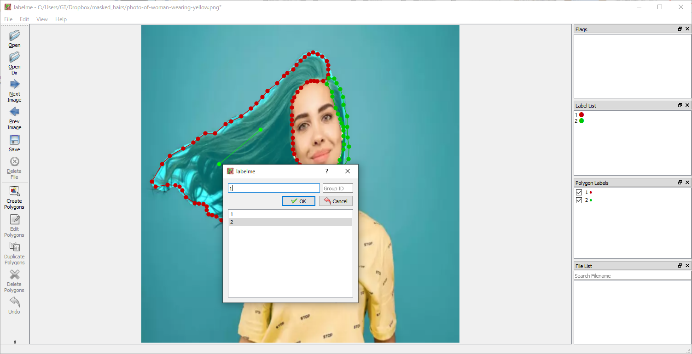
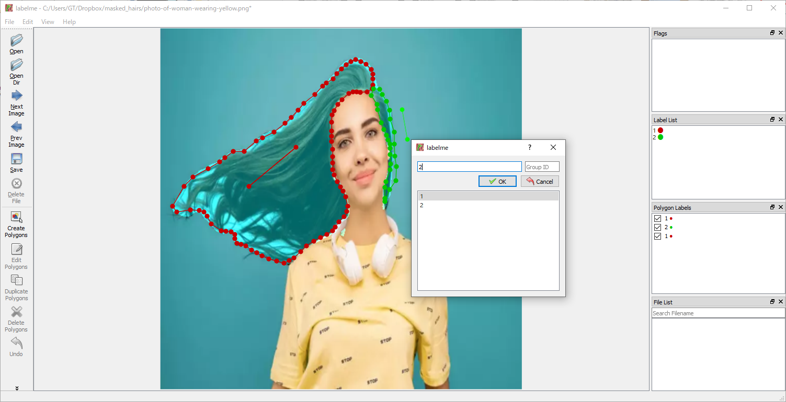

# autohair-annotation
1. 髪マスク作成
    ```
    cd face_parsing
    python get_hairmask.py
    ```
    - `get_hairmask.py` は `../images/` から画像を読み取り `../hair_masks/` に髪マスク画像，`../masked_hairs/` にマスクオーバーレイを保存する．
    - 出力画像サイズは(512,512)
    
2. 髪方向作成手法: 
    1. labelmeというソフトを使う
    
        [インストールと使い方はこちらを参考](https://github.com/wkentaro/labelme) 
            (pyqtを使うためmacosでは動かない可能性あり)

        1. `./masked_hairs` からマスクオーバーレイ画像を読み取る．
            
        2. polygonで各髪領域を書いて，ラベルをつける (0,1,2,...整数を使ってください).
            
        3. lineで各髪領域の方向を表す：
            - lineの原点が矢印の原点とみなして線を描く.
            - 対象髪領域と同じラベルをつける. **<== 大事**
            
            
            
        4. jsonファイルを`./points_json/'へ保存する．
